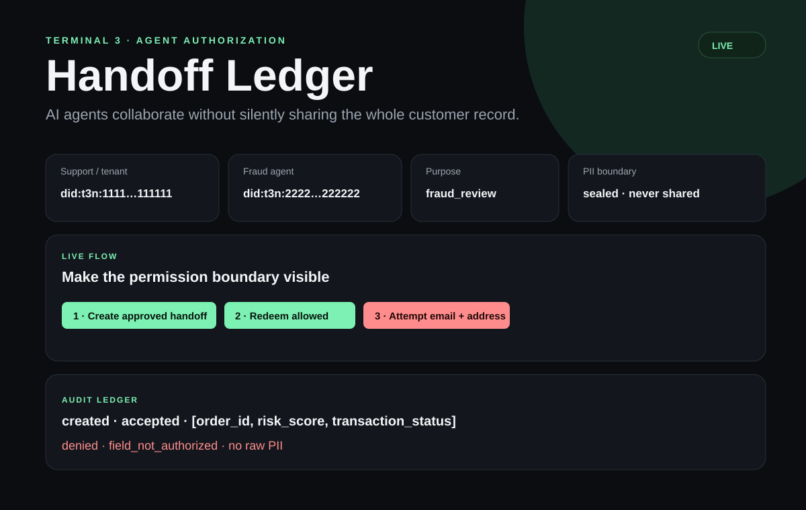
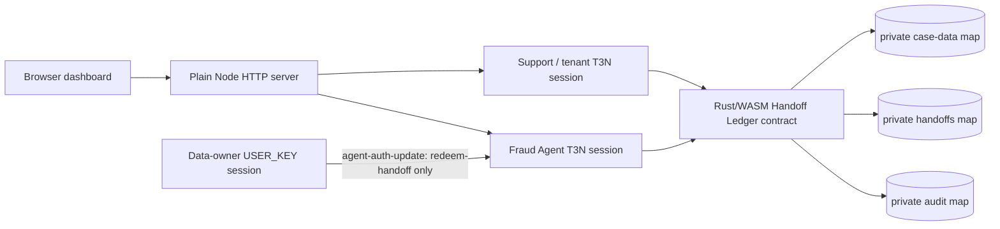

# Handoff Ledger

Handoff Ledger gives every AI-agent data transfer a scoped, time-limited, revocable permission boundary instead of silently forwarding a full customer record.

This is a Terminal 3 Agent Development Kit demo for a Support Agent handing a fraud-review case to a separate Fraud Agent.



## What the demo proves

The Support Agent creates a handoff bound to the Fraud Agent's authenticated DID, the purpose `fraud_review`, and a ten-minute expiry. The contract permits only `order_id`, `risk_score`, and `transaction_status` from a private tenant map. A request for `email` or `address` is denied; a revoked or replayed handoff is denied; and the audit ledger records decisions without raw customer values.

The case is synthetic:

```json
{
  "name": "Amir Rahman",
  "email": "amir@example.com",
  "order_id": "ORD-123",
  "address": "Kuala Lumpur",
  "risk_score": 92,
  "transaction_status": "flagged"
}
```

## Architecture



The live path uses three separate local key variables:

- `T3N_API_KEY`: Support/orchestrator tenant session.
- `USER_KEY`: data-owner session that signs the agent authorization grant.
- `AGENT_KEY`: Fraud Agent session.

The code reads DIDs from authenticated sessions and never derives or hardcodes live DIDs. The browser calls only the local server; keys and full DIDs stay server-side.

## T3N integration

The project uses `@terminal3/t3n-sdk` for `T3nClient`, authenticated sessions, `TenantClient`, tenant-local contract registration, private tenant maps, `executeAndDecode`, and `agent-auth-update`. The contract imports T3N tenant context and KV host interfaces. The contract's caller context binds redemption to the authenticated Fraud Agent DID.

Reference material: [T3N ADK quickstart](https://docs.terminal3.io/developers/adk/get-started/quickstart), [Agent Auth](https://docs.terminal3.io/developers/adk/overview/agent-auth-adk), [SDK reference](https://docs.terminal3.io/developers/adk/reference).

## Local setup

Requirements: Node 20+, npm, Rust, and the `wasm32-wasip2` Rust target.

```bash
npm install
npm run verify
npm run contract:test
rustup target add wasm32-wasip2
npm run contract:build
cp .env.example .env
```

No keys are needed for `npm run verify`. With no `MODE=live`, the dashboard uses the visible deterministic mock so the flow can be rehearsed offline.

## Live setup

Claim or request separate T3N credentials. Never reuse the tenant key as the agent key. Put them in `.env`; `.env` is ignored by Git.

```dotenv
T3N_ENV=testnet
T3N_API_KEY=tenant-key
USER_KEY=data-owner-key
AGENT_KEY=fraud-agent-key
MODE=live
```

Then register the contract, create the three private maps, seed the synthetic case, and grant the Fraud Agent only `redeem-handoff`:

```bash
npm run contract:build
npm run live:bootstrap
npm run live:smoke
MODE=live npm run dev
```

`live:bootstrap` writes only the non-secret local contract registration to `.handoff-ledger.live.json`; it never writes keys. If you intentionally register a new version, change `CONTRACT_VERSION` in `.env`.

## Demo actions

Open `http://localhost:3000` and follow the four buttons:

1. Create approved handoff.
2. Redeem the three approved fields; the Fraud Agent receives no name, email, or address.
3. Attempt `email` and `address`; the contract denies the request.
4. Create a fresh handoff, revoke it, and retry; the contract denies the revoked handoff.

`npm run verify` also checks expiry, replay, recipient mismatch, audit redaction, and tenant/agent DID separation.

## Security boundary and limitations

See [SECURITY.md](SECURITY.md). This is not production identity, KYC, payment, or fraud infrastructure. All sample customer data is synthetic. The MVP intentionally uses one case, one-time redemption, a local server, and no LLM or external API so the security flow stays deterministic in a three-minute demo.

## Three-minute video script

```text
0:00–0:20  Problem: agents silently pass full customer context
0:20–0:40  Architecture and T3N identities
0:40–1:10  Create scoped handoff
1:10–1:35  Fraud Agent receives only approved fields
1:35–1:55  Unauthorized email/address request is denied
1:55–2:20  Revoke permission and retry
2:20–2:40  Audit ledger
2:40–3:00  Why T3N and closing pitch
```

Closing pitch: “Handoff Ledger gives every AI-agent data transfer a cryptographic permission boundary. Agents can collaborate, but they cannot silently share user data.”

## Submission checklist

- [ ] Public GitHub repository; `.env` and all keys excluded.
- [ ] Clean-clone `npm install`, `npm run verify`, and contract tests pass.
- [ ] Live smoke output captured.
- [ ] YouTube walkthrough is under three minutes and viewable without login.
- [ ] GitHub and YouTube links tested in an incognito browser.
- [ ] Submit full name, email, WhatsApp, public repository URL, and YouTube URL through the event Google Form.

Licensed under [MIT](LICENSE).
